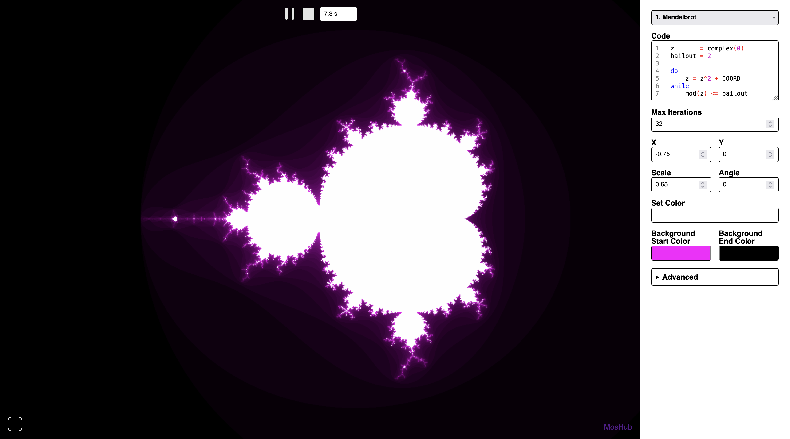
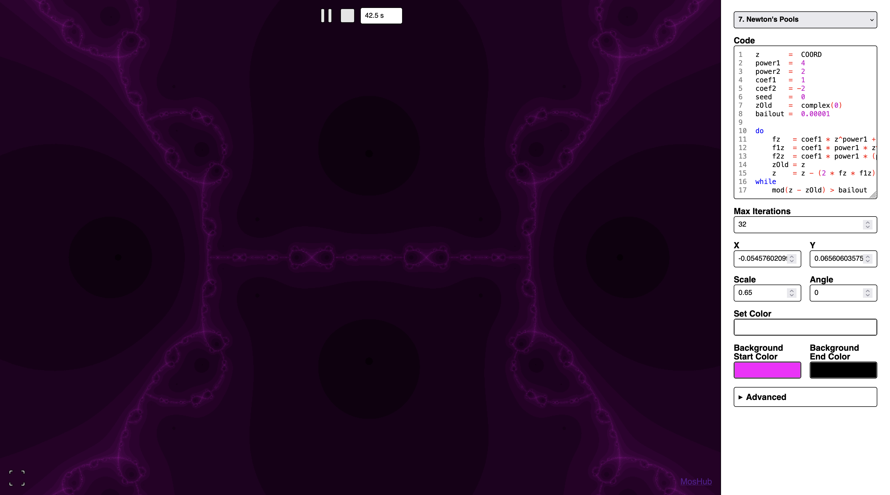
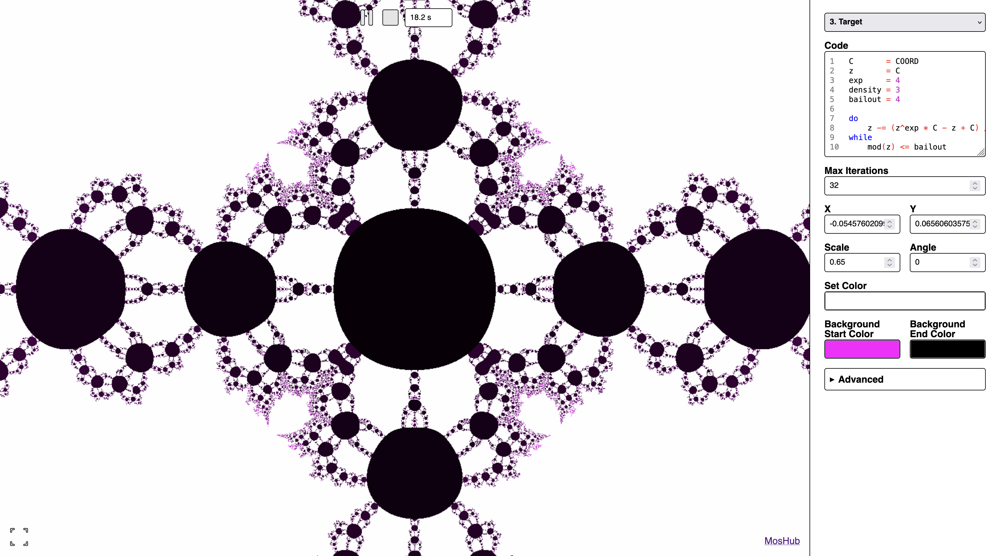
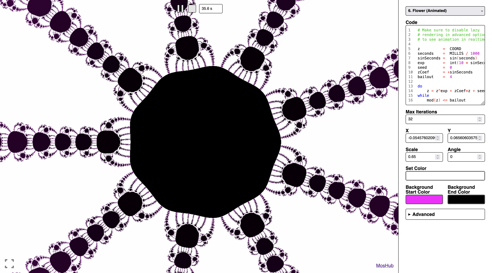

# Mandelbrot

## Table of Contents

- [Table of Contents](#table-of-contents);
- [About](#about);
- [Try](#try);
- [Usage](#usage);
- [Language](#language);
  - [Type System](#type-system);
- [Building](#building);
- [Running](#running);
- [Gallery](#gallery).

## About

This is a mini web-app for rendering fractals with use of recurrent expressions. You write formulas in a custom domain-specific language (DSL), and the app compiles them to GLSL shaders for real-time rendering in the browser.

The language supports complex numbers, arithmetic operations, exponentiation, and iterative recurrence relations with bailout conditions—everything needed to define classic fractals like the Mandelbrot set, Newton basins, and custom variants.

## Try

You can try it [here](https://mandelbrot.fominmv.ru/).

## Usage

1. Choose a predefined fractal from the dropdown or write your own code in the text area.
2. Click **Compile** to build the shader from your formula.
3. Use the view area to pan (drag), zoom (scroll), and rotate (angle control).
4. Adjust **Max Iterations**, **X**, **Y**, **Scale**, and **Angle** to explore the fractal.
5. Customize **Set Color** and **Background** colors for the gradient.
6. Enable **Autocompile** to recompile automatically when the code changes.
7. Use the time controller to step through animated fractals.

## Language

The `.mandelbrot` language describes iterative recurrence formulas. A typical program:

- Declares variables (complex or real) with `=`
- Uses `COORD` for the current pixel in the complex plane
- Uses a `do ... while` loop with a bailout condition (`mod(z) <= bailout`)
- Supports `complex()`, `^` (exponentiation), `*`, `/`, `+`, `-`, `mod()`

Example (classic Mandelbrot):

```mandelbrot
z       = complex(0)
bailout = 2

do
    z = z^2 + COORD
while
    mod(z) <= bailout
```

### Type System

Variables can be real numbers or complex numbers. Use `complex(0)` or `complex(real, imag)` for complex values. `COORD` is the complex coordinate of the current pixel. Arithmetic and exponentiation work on both types.

## Building

For building you will need [Node.js](https://nodejs.org/en).

After the installation of Node.js, first of all, set your current working directory to the root of this repository. After it, install all dependencies with the following command:

```bash
npm install
```

And after it, if no errors were emitted, build web-app with the following command:

```bash
npm run build
```

If no errors were emitted, you must have a built web-app in the `./dist/` folder.

## Running

For running you will need [Node.js](https://nodejs.org/en).

After the installation of Node.js, first of all, set your current working directory to the root of this repository. After it, install all dependencies with the following command:

```bash
npm install
```

And after it, if no errors were emitted, you can run web-app with the following command:

```bash
npm start
```

If no errors were emitted, a browser must open with running web-app. If browser didn't open automatically try to open [this page](http://localhost:8000/).

## Gallery

### Mandelbrot Set



### Newton's Pools



### Target



### Flower (Animated)


